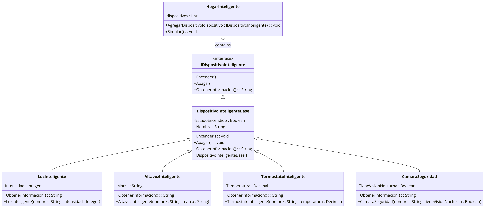

# Aplicación de Consola POO

## Descripción
Esta aplicación de consola en VB.NET simula la gestión de dispositivos en un entorno de hogar inteligente, demostrando la aplicación práctica de conceptos fundamentales de la Programación Orientada a Objetos, tales como herencia, polimorfismo y encapsulamiento.

## Entorno de Desarrollo
El proyecto se ha desarrollado utilizando .NET Framework 4.8, asegurando compatibilidad y rendimiento estable en una amplia gama de entornos Windows.

## Características
- Simulación de interacciones con dispositivos inteligentes dentro de un entorno de hogar.
- Aplicación de patrones de diseño y principios SOLID para una arquitectura de software sostenible.
- Flexibilidad para añadir nuevos dispositivos y funcionalidades.

## Diagrama UML

